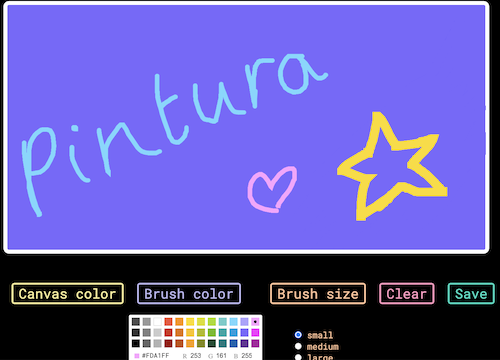

# 🎨 Pintura 

Pintura is a simple front-end only paint app. Coose the canvas color, brush color, and brush size. Clear the canvas or save your painting as a PNG file. 

## Notes to users:
- The app is not intended for touchscreens (phones or tables will not work).
- The drawing functionality only works properly in desktop and laptop computers.

### The deployed website is [here](https://pintura-mintbean.herokuapp.com/paint)

### The landing page is [here](https://pintura-mintbean.herokuapp.com/)

### To run the app in development mode: 
1. clone the repository to your local machine using `git clone` 
2. in the terminal, enter: `npm start`

## This app was made by:

- **Solene** ➱ [github](https://github.com/solenedel) [LinkedIn](https://ca.linkedin.com/in/solene-delumeau)

- **Gavin** ➱ [github](https://github.com/geecrypt) [LinkedIn](https://ca.linkedin.com/in/gacquroff)

